# NFC Card Integration: Identity & Events

This document visualizes the **Dual-Purpose** nature of our NFC cards. A single card serves two distinct functions depending on who is scanning it.

## 1. The "One Card, Two Paths" Flow

The physical NFC card stores a unique User ID. The system validates this ID differently based on the context (Networking vs. Attendance).


---

## 2. Scenario A: Public Profile (The "Linktree")

- **Context:** A user meets someone new and lets them tap their card.
- **Trigger:** Phone opens `https://gdg-pup.com/tap/:card_uid`.
- **Redirect Logic:** Website checks card status -> Redirects to Profile (e.g., `/id/janedoe`).
- **API Used:** `GET /api/identity/cards/:card_uid/status`

### Profile Payload (JSON)

The endpoint returns aggregated data for the "Linktree" view.

```json
// GET /api/identity/users/:handle
{
  "status": "success",
  "data": {
    "user": {
      "name": "Jane Doe",
      "avatar_url": "https://...",
      "role": "MEMBER"
    },
    "profile": {
      "bio": "Full Stack Dev @ GDG",
      "github": "https://github.com/jane",
      "linkedin": "https://linkedin.com/in/jane",
      "portfolio": "https://janedoe.dev"
    }
  }
}
```

---

## 3. Scenario B: Event Attendance (The Check-in)

- **Context:** An attendee arrives at a GDG event. The organizer is holding a phone/scanner running the **Admin App**.
- **Trigger:** The organizer actively scans the card's UUID into the attendance system.
- **Endpoint:** `POST /api/event-system/checkin`

### Attendance Sequence Diagram

```mermaid
sequenceDiagram
    participant Organizer as 👮 Organizer (Admin App)
    participant Card as 💳 Attendee Card
    participant API as 📅 Event API
    participant DB as 🗄️ Database

    Note over Organizer: Event: "Tech Talk 2025"

    Organizer->>Card: Scans Card
    Card-->>Organizer: Returns UUID (e.g., f47ac10...)

    Organizer->>API: POST /checkin
    Note right of Organizer: Payload: { eventId: "123", userId: "f47ac10...", method: "NFC" }

    API->>DB: Check if User exists & Not checked in

    alt Success
        API-->>Organizer: 200 OK "Checked In"
        DB->>DB: Record Timestamp
    else Already Checked In
        API-->>Organizer: 409 Conflict "Already Here"
    else Invalid User
        API-->>Organizer: 404 Error "User Unknown"
    end
```



### Attendance API Payload

When the Admin App scans the card, it sends this JSON to the server:

```json
// POST /api/event-system/checkin
{
  "data": {
    "eventId": "evt_abc12345", // Selected by Organizer
    "userId": "f47ac10b-58cc-...", // Scanned from NFC Card
    "checkinMethod": "NFC" // vs "OR_CODE" or "MANUAL"
  }
}
```
