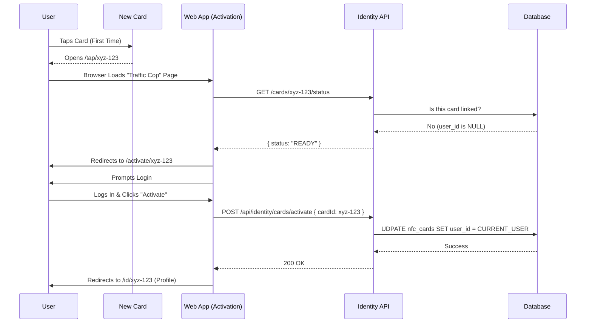

# 📦 NFC Card Distribution & Self-Activation

This document outlines the operational workflow for distributing NFC cards. We utilize a **Self-Service Activation** model, meaning cards are distributed "blank" (pre-programmed but unlinked) and users activate them personally.

## 1. The Strategy: "Unboxing" Experience

We moved away from the Admin-led provisioning. Now, the user is in control.

*   **Speed:** No long lines at the help desk. Just hand out the cards like swag.
*   **Engagement:** The user gets a magical "first tap" experience on their own device.
*   **Scalability:** We can distribute 1,000+ cards in minutes.

---

## 2. The Distribution Workflow 🤝

### Step 1: Handout
*   **Venue:** Check-in desk or Swag bag.
*   **Action:** Volunteer hands a card to the member.
*   **Validation:** Ideally verify they are a registered attendee, but technically **it doesn't matter** if a non-member gets a card, because they cannot activate it without a valid GDG Account login.

---

## 3. The Activation Workflow (User Journey) �

This happens on the user's phone, at their own pace.

### Step 1: The Magic Tap
User taps their new card on their phone.
*   **Card Payload:** `https://gdg-pup.com/tap/crd_123`
*   **Result:** Phone opens browser. The page checks `GET /api/identity/cards/crd_123/status`.

### Step 2: System Check
The system checks the `nfc_cards` database table for ID `a1b2-c3d4...`.
*   **Condition:** Is `user_id` NULL?
    *   **YES:** Show **Activation Screen**.
    *   **NO:** Show **Public Profile** (Already owned).

### Step 3: Authentication
*   **Screen:** "Welcome! Please login to claim this card."
*   **Action:** User logs in with their GDG / Google Account.

### Step 4: Confirmation
*   **Screen:** "Do you want to link this card to **[Jane Doe]**?"
*   **Action:** User clicks **"Start My Portfolio"**.

### Step 5: Success
*   **System:** Updates database -> Sets `user_id` to Jane's ID.
*   **UI:** Redirects immediately to Jane's new Public Profile.
*   **Result:** The card is now permanently hers.

---

## 4. Visual Sequence Diagram

---

## 5. Handling Issues

### "This card is already active!"
If a user taps a card that belongs to someone else:
*   **Screen:** "This card belongs to **[John Smith]**."
*   **Action:** User cannot claim it.

### "Card Not Found"
If a user taps a card that wasn't in our CSV/Database:
*   **Screen:** "Invalid Card. Please return to the help desk."
*   **Reason:** The card might be damaged or was missed during the Encoding Phase.

### Lost Cards
The user can login to their dashboard and click **"Deactivate Card"**.
*   This sets `nfc_cards.status` to `LOST` and unlinks it so no one else can scan it.
