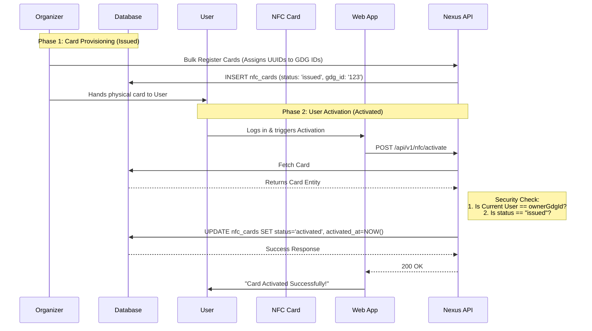

# 📦 NFC Card Distribution & Activation

This document outlines the operational workflow for distributing NFC cards. We utilize a **Pre-Assigned Activation** model, meaning cards are linked to a specific user *before* or *during* distribution, and the user must explicitly "activate" the card to verify possession before it can be used.

## 1. The Strategy: "Pre-Assigned" Model

- **Security:** Cards are explicitly linked to a user (`gdgId`) upon physical creation/distribution. If someone steals a card, they cannot claim it or use it, because the backend explicitly ties the physical card UUID to a single user.
- **Verification:** The user must natively log in to the platform and authorize the activation to prove they physically received the exact card assigned to them.
- **Status Machine:** Cards strictly progress through statuses: `"issued"` ➡️ `"activated"` ➡️ `"suspended"`/`"revoked"`.

---

## 2. The Distribution Workflow 🤝

### Step 1: Assignment
- **System:** Administrators bulk-generate NFC cards using the `CreateCardsBulkUseCase` or individually via `CreateCardUseCase`.
- **Database:** Cards are inserted into the `nfc_cards` table with:
  - `id`: The UUID burned into the card.
  - `gdg_id`: The ID of the specific member receiving the card.
  - `status`: Strictly set to `"issued"`.
  - `activated_at`: `NULL`.

### Step 2: Handout
- **Action:** An administrator or volunteer physically hands the pre-assigned card to the correct member.

---

## 3. The Activation Workflow (User Journey)

This happens on the user's device to securely formalize their possession of the card.

### Step 1: The Trigger
- **Action:** The user logs into the Nexus Platform.
- **Action:** The user taps the card on their phone (which hits an intercept endpoint) OR actively clicks an "Activate Card" button within their Sparkmates setting dashboard.

### Step 2: Authorization Check
- **API Call:** The frontend sends a request to `POST .../useCase/ActivateCardUseCase` (if activated by card UUID) or `ActivateByGdgId` (if automatically inferred from their session).
- **Validation Engine:** 
  1. The backend compares requesting user's ID against the card's `ownerGdgId`. If they do not match, it instantly throws an `Unauthorized: Only the card owner can activate the card` error.
  2. The backend checks the card's domain `status`. It must be exactly `"issued"` to proceed. Doing this on an already active card throws an error.

### Step 3: Success & Persistence
- **Mutation:** The core domain entity `NfcCard` fires `.activate()`, changing internal state securely.
- **Database Updates:** The `NfcRepository` executes `persistUpdates(card)` directly to the `nfc_cards` row:
  - `status` updates to `"activated"`.
  - `activated_at` receives a fresh ISO 8601 timestamp.
- **Result:** The card is officially live! It can now be used smoothly at check-in events and public scans.

---

## 4. Visual Sequence Diagram

```mermaid
sequenceDiagram
    participant Admin as Organizer
    participant DB as Database
    participant User as User
    participant Card as NFC Card
    participant App as Web App
    participant API as Nexus API

    Note over Admin,DB: Phase 1: Card Provisioning (Issued)
    Admin->>API: Bulk Register Cards (Assigns UUIDs to GDG IDs)
    API->>DB: INSERT nfc_cards (status: 'issued', gdg_id: '123')
    Admin->>User: Hands physical card to User

    Note over User,API: Phase 2: User Activation (Activated)
    User->>App: Logs in & triggers Activation
    App->>API: POST /api/v1/nfc/activate
    API->>DB: Fetch Card
    DB-->>API: Returns Card Entity
    
    Note right of API: Security Check:<br/>1. Is Current User == ownerGdgId?<br/>2. Is status == "issued"?
    
    API->>DB: UPDATE nfc_cards SET status='activated', activated_at=NOW()
    DB-->>API: Success Response
    API-->>App: 200 OK
    App->>User: "Card Activated Successfully!"
```
