# 📱 Admin Scanner App Documentation

This document outlines the requirements and flow for the **Admin Scanner App**, a specialized tool for GDG Organizers to manage event check-ins efficiently using the attendees' NFC cards.

## 1. Why a Dedicated App?
Standard mobile browsers (Chrome/Safari) are designed for "Passive" reading (opening a URL). They are **not** optimized for rapid checking-in of hundreds of people. The Admin App provides the necessary speed, control, and feedback loop.

---

## 2. Key Features

### 📅 Event Selection
*   Organizers login and see a list of **"Today's Events"** or **"Active Events"**.
*   They tap an event (e.g., *DevFest 2025*) to enter "Scanning Mode".

### 📶 "Rapid Fire" Scanning Mode
*   The phone stays awake and actively listens for NFC tags.
*   **Zero Clicks:** The organizer just holds the phone near the reader/table.
*   **Instant Reset:** Immediately ready for the next person after a scan.

### ✅ Visual & Audio Feedback
*   **Green Screen + "Ping"** = Valid Check-in.
*   **Red Screen + "Buzz"** = Invalid, Duplicate, or Unregistered.
*   **Yellow Screen** = "User Recognized but NOT Registered" (Option to Quick Register).

### ☁️ Offline Queue (Optional)
*   If Wi-Fi drops, scans are saved locally and synced when the connection returns, ensuring no data loss.

---

## 3. User Flow (Organizer Perspective)

```mermaid
graph TD
    Login[Login as Admin] --> SelectEvent["Select Event (e.g., Tech Talk)"]
    SelectEvent --> ScanMode["Ready to Scan 📡"]
    
    ScanMode -->|Scan Card| Processing{Validating...}
    
    Processing -->|Success| Success["✅ CHECKED IN <br/> Show Name & Avatar"]
    Processing -->|Duplicate| Duplicate["⚠️ ALREADY HERE <br/> Show Timestamp"]
    Processing -->|Error| Error["❌ NOT FOUND <br/> Show Unknown ID"]
    
    Success -->|Wait 2s| ScanMode
    Duplicate -->|Tap to Dismiss| ScanMode
    Error -->|Tap to Dismiss| ScanMode
```

---

## 4. Technical Architecture

### Tech Stack Recommendation
*   **Framework:** React Native or Flutter (Cross-platform).
*   **NFC Library:** `react-native-nfc-manager` (Allows reading UID directly).

### Data Flow

```mermaid
sequenceDiagram
    participant App as 📲 Admin App
    participant Card as 💳 Attendee Card
    participant API as 🛡️ Event API

    Note over App: Organizer selects Event #123
    
    Card->>App: (Tap) URL: gdg-pup.com/tap/crd_123
    App->>App: Parses ID: crd_123
    
    App->>App: Feedback: "Beep! 🔊"
    App->>API: POST /api/event-system/checkin { eventId: 123, cardId: crd_123 }
    
    API->>API: Lookup User from Card ID
    
    alt API Responds 200 OK
        API-->>App: { status: "success", user: "Jane Doe" }
        App->>App: Screen: 🟩 GREEN (Jane Doe)
    else API Responds 409 Conflict
        API-->>App: { error: "Already checked in" }
        App->>App: Screen: 🟨 YELLOW (Duplicate)
    end
```

---

## 5. Security Considerations
*   **Authorized Devices Only:** The app should require an Admin/Organizer login.
*   **Audit Logs:** Record *who* performed the scan (which organizer checked in which user).
