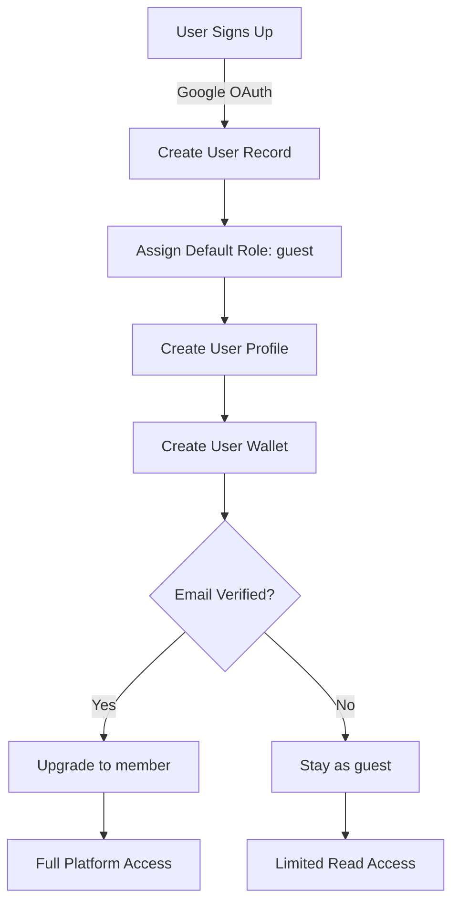

# GDG PUP Platform - RBAC Analysis & Implementation Blueprint

## 📊 Project Analysis Summary

### Current Architecture
The GDG PUP Platform is a **monorepo** with:
- **Apps**: `identity-api`, `nexus-api`, `nexus-web`
- **Packages**: Shared contracts, types, and utilities

### Existing RBAC Foundation
The project already has a **partial RBAC implementation**:
- ✅ Database tables: `user_role`, `user_role_junction`, `user_role_permission`
- ✅ Basic middleware: `AuthMiddleware` with role checking
- ✅ RBAC module structure in `nexus-api`
- ⚠️ **Incomplete**: Limited endpoints, no permission management, basic role checks only

---

## 🔍 Current User Endpoints Analysis

### **Identity API** (Port: TBD)
Currently minimal - only health check implemented.

### **Nexus API** - Main User & Resource Endpoints

#### **User System** (`/api/user-system`)
| Endpoint | Method | Auth Required | Current Role Check | Purpose |
|----------|--------|---------------|-------------------|---------|
| `/users` | GET | ❌ | None | List all users |
| `/users/:userId` | GET | ❌ | None | Get user details |
| `/users/:userId/aggregate` | GET | ❌ | None | Get user aggregate data |
| `/users/:userId/wallet` | GET | ❌ | None | Get user wallet |
| `/users/:userId/wallet/transactions` | GET | ❌ | None | List wallet transactions |
| `/users/:userId/roles` | GET | ❌ | None | Get user roles |
| `/users/:userId/profile` | GET | ❌ | None | Get user profile |
| `/users/:userId/projects` | GET | ❌ | None | List user projects |

**⚠️ Security Gap**: No authentication or authorization on user endpoints!

#### **User Resource System** (`/api/user-resource-system`)
| Endpoint | Method | Auth Required | Current Role Check | Purpose |
|----------|--------|---------------|-------------------|---------|
| `/projects` | GET | ❌ | None | List all projects |
| `/projects` | POST | ✅ | requireAuth() | Create project |
| `/projects/:projectId` | GET | ❌ | None | Get project |
| `/projects/:projectId` | DELETE | ✅ | requireAuth() | Delete project |
| `/projects/:projectId` | PATCH | ✅ | requireAuth() | Update project |
| `/profiles` | * | ✅ | requireAuth() | Profile operations |

**✅ Partial Protection**: Write operations require auth, reads are public.

#### **Event System** (`/api/event-system`)
| Endpoint | Method | Auth Required | Current Role Check | Purpose |
|----------|--------|---------------|-------------------|---------|
| `/events` | GET | ❌ | None | List events |
| `/events` | POST | ✅ | requireAuth() | Create event |
| `/events/:eventId` | GET | ✅ | requireAuth() | Get event |
| `/events/:eventId` | DELETE | ✅ | requireAuth() | Delete event |
| `/events/:eventId` | PUT | ✅ | requireAuth() | Update event |
| `/events/:eventId/attendees` | GET | ❌ | None | List attendees |
| `/checkin` | POST | ✅ | requireAuth() | Check-in to event |

**✅ Partial Protection**: Write operations protected.

#### **Publication System** (`/api/publication-system`)
| Endpoint | Method | Auth Required | Current Role Check | Purpose |
|----------|--------|---------------|-------------------|---------|
| `/articles` | GET | ❌ | None | List articles |
| `/articles` | POST | ✅ | requireAuth() | Create article |
| `/articles/:articleId` | GET | ❌ | None | Get article |
| `/articles/:articleId` | DELETE | ✅ | requireAuth() | Delete article |
| `/articles/:articleId` | PUT | ✅ | requireAuth() | Update article |
| `/articles/:articleId/comments` | GET | ❌ | None | List comments |
| `/articles/:articleId/comments` | POST | ✅ | requireAuth() | Create comment |

#### **Economy System** (`/api/economy-system`)
| Endpoint | Method | Auth Required | Current Role Check | Purpose |
|----------|--------|---------------|-------------------|---------|
| `/transactions` | GET | ❌ | None | List transactions |
| `/wallets` | * | ❌ | None | Wallet operations |

**⚠️ Security Gap**: Sensitive financial data exposed!

#### **Resource System** (`/api/resource-system`)
| Endpoint | Method | Auth Required | Current Role Check | Purpose |
|----------|--------|---------------|-------------------|---------|
| `/resources` | GET | ❌ | None | List resources |
| `/resources` | POST | ✅ | requireAuth() | Create resource |
| `/resources/:resourceId` | GET | ❌ | None | Get resource |
| `/resources/:resourceId` | DELETE | ✅ | requireAuth() | Delete resource |
| `/resources/:resourceId` | PUT | ✅ | requireAuth() | Update resource |

#### **RBAC System** (`/api/rbac-system`)
| Endpoint | Method | Auth Required | Current Role Check | Purpose |
|----------|--------|---------------|-------------------|---------|
| `/roles` | GET | ❌ | None | List roles or get user roles |

**⚠️ Incomplete**: No role/permission management endpoints!

#### **Other Systems**
- **Team System** (`/api/team-system`)
- **Reward System** (`/api/reward-system`)
- **Learning Resource System** (`/api/learning-resource-system`)
- **File System** (`/api/file-system`)
- **Leaderboard System** (`/api/leaderboard-system`)

---

## 🎯 RBAC Implementation Blueprint

### Database Schema (Already Exists ✅)

```sql
-- Role definitions
CREATE TABLE user_role (
  id UUID PRIMARY KEY,
  role_name TEXT UNIQUE NOT NULL,
  description TEXT NOT NULL
);

-- User-Role assignment (Many-to-Many)
CREATE TABLE user_role_junction (
  id UUID PRIMARY KEY,
  user_id UUID REFERENCES user(id),
  role_id UUID REFERENCES user_role(id),
  created_at TIMESTAMP DEFAULT NOW()
);

-- Permission definitions per role
CREATE TABLE user_role_permission (
  id UUID PRIMARY KEY,
  user_role_id UUID REFERENCES user_role(id),
  resource_name TEXT NOT NULL,  -- e.g., 'events', 'articles', 'users'
  can_read BOOLEAN DEFAULT FALSE,
  can_write BOOLEAN DEFAULT FALSE,
  can_update BOOLEAN DEFAULT FALSE,
  can_delete BOOLEAN DEFAULT FALSE
);
```

### Recommended Role Structure

#### **Default Roles**

| Role | Description | Typical Users |
|------|-------------|---------------|
| `super_admin` | Full system access, manage roles & permissions | Platform administrators |
| `admin` | Manage content, users, events | GDG organizers |
| `moderator` | Moderate content, manage events | Event coordinators |
| `member` | Create/edit own content | Verified GDG members |
| `guest` | Read-only access | Public users, visitors |

### Resource Mapping

| Resource Name | Description | Related Endpoints |
|---------------|-------------|-------------------|
| `users` | User management | `/api/user-system/users/*` |
| `profiles` | User profiles | `/api/user-resource-system/profiles/*` |
| `projects` | User projects | `/api/user-resource-system/projects/*` |
| `events` | Event management | `/api/event-system/events/*` |
| `articles` | Articles/Publications | `/api/publication-system/articles/*` |
| `resources` | Learning resources | `/api/resource-system/resources/*` |
| `wallets` | Economy/Wallet system | `/api/economy-system/wallets/*` |
| `transactions` | Transaction history | `/api/economy-system/transactions/*` |
| `teams` | Team management | `/api/team-system/*` |
| `roles` | Role management | `/api/rbac-system/roles/*` |
| `permissions` | Permission management | `/api/rbac-system/permissions/*` |
| `rewards` | Rewards system | `/api/reward-system/*` |

### Recommended Permission Matrix

```typescript
// Example permission configuration
const DEFAULT_PERMISSIONS = {
  super_admin: {
    '*': { can_read: true, can_write: true, can_update: true, can_delete: true }
  },
  admin: {
    users: { can_read: true, can_write: false, can_update: true, can_delete: false },
    events: { can_read: true, can_write: true, can_update: true, can_delete: true },
    articles: { can_read: true, can_write: true, can_update: true, can_delete: true },
    resources: { can_read: true, can_write: true, can_update: true, can_delete: true },
    roles: { can_read: true, can_write: false, can_update: false, can_delete: false }
  },
  moderator: {
    events: { can_read: true, can_write: true, can_update: true, can_delete: false },
    articles: { can_read: true, can_write: false, can_update: true, can_delete: false },
    resources: { can_read: true, can_write: true, can_update: true, can_delete: false }
  },
  member: {
    events: { can_read: true, can_write: false, can_update: false, can_delete: false },
    articles: { can_read: true, can_write: true, can_update: true, can_delete: false }, // own only
    projects: { can_read: true, can_write: true, can_update: true, can_delete: true }, // own only
    profiles: { can_read: true, can_write: false, can_update: true, can_delete: false } // own only
  },
  guest: {
    events: { can_read: true, can_write: false, can_update: false, can_delete: false },
    articles: { can_read: true, can_write: false, can_update: false, can_delete: false },
    resources: { can_read: true, can_write: false, can_update: false, can_delete: false }
  }
};
```

---

## 🔧 Implementation Steps

### Phase 1: Enhance RBAC Module ⚡ Priority

#### 1.1 Complete Role Management Endpoints

**Location**: `apps/nexus-api/src/modules/rbacSystem/`

**New Endpoints Needed**:
```typescript
// Role Management
POST   /api/rbac-system/roles              - Create role (admin only)
GET    /api/rbac-system/roles              - List all roles
GET    /api/rbac-system/roles/:roleId      - Get role details
PUT    /api/rbac-system/roles/:roleId      - Update role (admin only)
DELETE /api/rbac-system/roles/:roleId      - Delete role (admin only)

// User-Role Assignment
POST   /api/rbac-system/users/:userId/roles              - Assign role to user (admin)
DELETE /api/rbac-system/users/:userId/roles/:roleId      - Remove role from user (admin)
GET    /api/rbac-system/users/:userId/roles              - Get user roles (already exists)

// Permission Management
GET    /api/rbac-system/roles/:roleId/permissions        - List role permissions
POST   /api/rbac-system/roles/:roleId/permissions        - Add permission to role (admin)
PUT    /api/rbac-system/roles/:roleId/permissions/:permId - Update permission (admin)
DELETE /api/rbac-system/roles/:roleId/permissions/:permId - Remove permission (admin)
```

#### 1.2 Enhanced Middleware

**File**: `apps/nexus-api/src/middlewares/auth.middleware.ts`

**New Methods**:
```typescript
export class AuthMiddleware {
  // Existing methods
  requireAuth(): RequestHandler;
  requireAdminRole(): RequestHandler;
  requireAnyOfTheseRoles(allowedRoles: string[]): RequestHandler;

  // NEW: Permission-based authorization
  requirePermission(
    resourceName: string, 
    action: 'read' | 'write' | 'update' | 'delete'
  ): RequestHandler;

  // NEW: Resource ownership check
  requireOwnershipOr(
    resourceGetter: (req: Request) => Promise<{ userId: string }>,
    fallbackRoles: string[]
  ): RequestHandler;

  // NEW: Combined role and permission check
  requireRoleOrPermission(
    allowedRoles: string[],
    resourceName: string,
    action: 'read' | 'write' | 'update' | 'delete'
  ): RequestHandler;
}
```

#### 1.3 Permission Service

**File**: `apps/nexus-api/src/modules/rbacSystem/permission.service.ts`

```typescript
export class PermissionService {
  // Check if user has specific permission
  async userHasPermission(
    userId: string,
    resourceName: string,
    action: 'read' | 'write' | 'update' | 'delete'
  ): Promise<boolean>;

  // Get all permissions for a user
  async getUserPermissions(userId: string): Promise<Permission[]>;

  // Get permissions for a role
  async getRolePermissions(roleId: string): Promise<Permission[]>;

  // Add/Update/Delete permissions for a role
  async setRolePermission(roleId: string, permission: PermissionDTO): Promise<void>;
}
```

### Phase 2: Secure Existing Endpoints 🔒

#### 2.1 User System Security

**File**: `apps/nexus-api/src/modules/userSystem/user.route.ts`

```typescript
export class UserRouter {
  getRouter() {
    const router = Router();

    // List users - require read permission
    router.get(
      "/",
      this.authMiddleware.requirePermission('users', 'read'),
      this.userSystemController.listUsers
    );

    // Get user - public for own data, require permission for others
    router.get(
      "/:userId",
      this.authMiddleware.requireOwnershipOr(
        async (req) => ({ userId: req.params.userId }),
        ['admin', 'moderator']
      ),
      this.userSystemController.getUserById
    );

    // User wallet - only owner or admin
    router.get(
      "/:userId/wallet",
      this.authMiddleware.requireOwnershipOr(
        async (req) => ({ userId: req.params.userId }),
        ['admin']
      ),
      this.userSystemController.getUserWallet
    );

    return router;
  }
}
```

#### 2.2 Event System Security

**File**: `apps/nexus-api/src/modules/eventSystem/event.route.ts`

```typescript
router.post(
  "/",
  this.authMiddleware.requirePermission('events', 'write'),
  this.eventSystemController.createEvent
);

router.put(
  "/:eventId",
  this.authMiddleware.requirePermission('events', 'update'),
  this.eventSystemController.updateEvent
);

router.delete(
  "/:eventId",
  this.authMiddleware.requirePermission('events', 'delete'),
  this.eventSystemController.deleteEvent
);
```

#### 2.3 Economy System Security

**File**: `apps/nexus-api/src/modules/economySystem/transaction.route.ts`

```typescript
router.get(
  "/",
  this.authMiddleware.requireRoleOrPermission(
    ['admin', 'super_admin'],
    'transactions',
    'read'
  ),
  this.transactionController.listTransactions
);
```

### Phase 3: Token Parser Enhancement 🔑

**File**: `apps/nexus-api/src/middlewares/tokenParser.ts`

**Enhancement**: Automatically load user roles and cache permissions.

```typescript
export const tokenParserFromHeaders: RequestHandler = async (req, res, next) => {
  try {
    const authHeader = req.headers.authorization;
    const supabaseAccessToken = authHeader?.startsWith("Bearer ")
      ? authHeader.split(" ")[1]
      : undefined;

    if (supabaseAccessToken) {
      const { data: user, error: userError } =
        await supabase.auth.getUser(supabaseAccessToken);

      if (!userError && user) {
        req.user = user.user;
        
        // NEW: Load user roles and permissions
        const roles = await roleService.getRolesOfUser(user.user.id);
        req.userRoles = roles.data?.list || [];
        
        // Cache primary role
        req.role = roles.data?.list[0]?.role_name || 'guest';
        
        // Load and cache permissions
        const permissions = await permissionService.getUserPermissions(user.user.id);
        req.userPermissions = permissions;
      }
    }

    req.supabaseAccessToken = supabaseAccessToken;
    return next();
  } catch (error) {
    req.user = undefined;
    req.role = 'guest';
    req.userRoles = [];
    req.userPermissions = [];
    return next();
  }
};
```

### Phase 4: Type Definitions 📝

**File**: `apps/nexus-api/src/types/express/index.d.ts`

```typescript
declare global {
  namespace Express {
    interface Request {
      user?: User;
      role?: string;
      userRoles?: Role[];
      userPermissions?: Permission[];
      supabaseAccessToken?: string;
      googleAccessToken?: string;
    }
  }
}

export interface Permission {
  id: string;
  resource_name: string;
  can_read: boolean;
  can_write: boolean;
  can_update: boolean;
  can_delete: boolean;
}

export interface Role {
  id: string;
  role_name: string;
  description: string;
}
```

### Phase 5: Seed Default Roles 🌱

**File**: `apps/nexus-api/src/modules/rbacSystem/seed.ts`

```typescript
export async function seedDefaultRoles() {
  const roles = [
    {
      role_name: 'super_admin',
      description: 'Full system access',
      permissions: [{ resource_name: '*', can_read: true, can_write: true, can_update: true, can_delete: true }]
    },
    {
      role_name: 'admin',
      description: 'Administrative access',
      permissions: [
        { resource_name: 'events', can_read: true, can_write: true, can_update: true, can_delete: true },
        { resource_name: 'articles', can_read: true, can_write: true, can_update: true, can_delete: true },
        { resource_name: 'users', can_read: true, can_write: false, can_update: true, can_delete: false }
      ]
    },
    {
      role_name: 'member',
      description: 'Regular member access',
      permissions: [
        { resource_name: 'events', can_read: true, can_write: false, can_update: false, can_delete: false },
        { resource_name: 'articles', can_read: true, can_write: true, can_update: true, can_delete: false }
      ]
    },
    {
      role_name: 'guest',
      description: 'Public read-only access',
      permissions: [
        { resource_name: 'events', can_read: true, can_write: false, can_update: false, can_delete: false },
        { resource_name: 'articles', can_read: true, can_write: false, can_update: false, can_delete: false }
      ]
    }
  ];

  for (const role of roles) {
    await roleService.createRole(role);
  }
}
```

---

## 📋 Implementation Checklist

### Immediate Actions (Week 1)
- [ ] Create enhanced permission middleware methods
- [ ] Implement permission service with database queries
- [ ] Add CRUD endpoints for roles
- [ ] Add CRUD endpoints for permissions
- [ ] Update tokenParser to load roles/permissions
- [ ] Update Express types for new request properties

### Security Hardening (Week 2)
- [ ] Secure User System endpoints
- [ ] Secure Economy System endpoints (critical!)
- [ ] Secure Event System endpoints
- [ ] Secure Publication System endpoints
- [ ] Secure Resource System endpoints
- [ ] Add ownership checks for user-owned resources

### Testing & Validation (Week 3)
- [ ] Create seed script for default roles
- [ ] Test role assignment
- [ ] Test permission checks
- [ ] Test ownership validation
- [ ] Document all RBAC endpoints
- [ ] Create admin interface for role management

### Documentation (Week 4)
- [ ] Update API documentation with auth requirements
- [ ] Create role management guide for admins
- [ ] Document permission matrix
- [ ] Add RBAC examples to ARCHITECTURE.md

---

## 🎨 User Blueprint

### User Data Model

```typescript
interface User {
  // Core Identity
  id: string;
  email: string;
  gdg_id: string;
  display_name: string;
  first_name?: string;
  last_name?: string;
  avatar_url?: string;
  status: 'active' | 'inactive' | 'suspended';
  
  // Timestamps
  created_at: Date;
  updated_at: Date;
  
  // Relations
  profile?: UserProfile;
  projects?: Project[];
  wallet?: Wallet;
  roles?: Role[];
  
  // Computed
  primaryRole: string; // First role in roles array
  permissions: Permission[];
}
```

### User Lifecycle



### User Role Transition

```typescript
// User role progression
guest → member → moderator → admin → super_admin

// Triggers for role upgrades:
// guest → member: Email verification + profile completion
// member → moderator: Admin assignment (event organizer)
// moderator → admin: Admin assignment (core team)
// admin → super_admin: Super admin assignment (platform owner)
```

---

## 🔐 Security Best Practices

### 1. Principle of Least Privilege
- Users should only have permissions necessary for their role
- Default to `guest` role for new users
- Require explicit permission grants

### 2. Defense in Depth
- Multiple layers: Authentication → Role Check → Permission Check → Ownership Check
- Never trust client-side data
- Always validate user identity on server

### 3. Audit Logging
- Log all permission changes
- Log role assignments/removals
- Track who performed admin actions

### 4. Resource Ownership
```typescript
// Always check ownership for user-specific resources
const canAccess = 
  resource.user_id === currentUser.id || 
  currentUser.roles.includes('admin');
```

---

## 🚀 Quick Start Implementation

### Step 1: Create Permission Middleware

```bash
# Create new file
touch apps/nexus-api/src/middlewares/permission.middleware.ts
```

### Step 2: Implement Role Management

```bash
# Add endpoints
touch apps/nexus-api/src/modules/rbacSystem/role.controller.ts
touch apps/nexus-api/src/modules/rbacSystem/permission.controller.ts
```

### Step 3: Update Routes

Apply middleware to existing routes:
```typescript
// Before
router.post("/events", this.authMiddleware.requireAuth(), handler);

// After
router.post("/events", 
  this.authMiddleware.requireAuth(),
  this.authMiddleware.requirePermission('events', 'write'),
  handler
);
```

---

## 📞 Next Steps

1. **Review this blueprint** with the development team
2. **Prioritize implementation phases** based on security criticality
3. **Set up development environment** for RBAC testing
4. **Create test users** with different roles
5. **Begin Phase 1 implementation**

---

## ❓ Questions to Address

1. **Who should be the first super_admin?**
2. **How are roles assigned initially?** (Manual admin process? Automated based on email domain?)
3. **Should we implement role hierarchies?** (Admin automatically gets moderator permissions?)
4. **Do we need time-limited roles?** (Temporary event coordinator role?)
5. **Should permissions be cacheable?** (Redis caching for performance?)

---

**Document Version**: 1.0  
**Last Updated**: January 23, 2026  
**Author**: GitHub Copilot  
**Status**: 📋 Ready for Implementation
